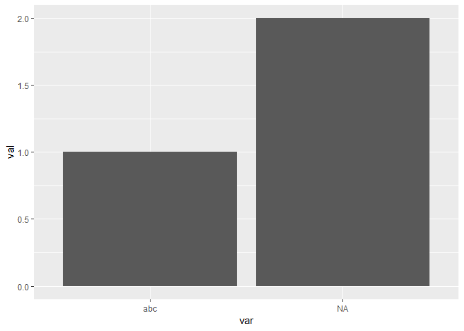

R Factors: Explicit vs. Implicit Missingness
================
Helge Bruegner
12 6 2019

## Explicit vs. implicit

Consider the following two factors (we have to set `exclude = NULL` such
that `factor()` doesn’t remove `NA` from our `levels` attribute):

``` r
one <- factor(c("abc", NA, NA), levels = c("abc", NA), exclude = NULL)
two <- factor(c("abc", "def", NA), levels = c("abc", NA), exclude = NULL)

dplyr::all_equal(two, one)
```

    ## [1] "Cols in y but not x: `structure(c(1L, 2L, 2L), .Label = c(\"abc\", NA), class = \"factor\")`. "
    ## [2] "Cols in x but not y: `structure(c(1L, NA, 2L), .Label = c(\"abc\", NA), class = \"factor\")`. "

Intuitively, we would expect `one` and `two` to be the same, right? They
aren’t\!

Let’s have a closer look at the output of `all_equals()`. In both lines
we see a `structure()` that represents the factor we passed into the
function – lines `[1]` and `[2]` correspond to factors `one` and `two`,
respectively. The first vector in the `structure()` references the
labels (`.Label`) by index.

In `[1]`, we see that the first vector (`c(1L, 2L, 2L)`) refers to level
`"abc"` once and to `NA` twice. This is the behavior we expect. However,
in `[2]`, we encounter the vector `c(1L, NA, 2L)` which causes the
`all_equal()` to fail. Where does the `NA` come from?

Well, the reason is in R factors we have to differentiate between
*explicit* and *implicit* missingness. The R `factor()` function tries
to pair up each value it receives with a corresponding level. If it
can’t find any, the value is missing *implicitly* and the “pointer” is
set to `NA` (the `NA` all the way at the end):

``` r
str(factor(c("abc", "def"), levels = c("abc", NA), exclude = NULL))
```

    ##  Factor w/ 2 levels "abc",NA: 1 NA

If we instead encounter an `NA` as value and we have specified it
*explicitly*, well, we have *explicit* missingness (we don’t see any
`NA` in the end of the line):

``` r
str(factor(c("abc", NA), levels = c("abc", NA), exclude = NULL))
```

    ##  Factor w/ 2 levels "abc",NA: 1 2

## What can we do about it?

There are multiple possibilities that you can use to get rid of the
implicit missing values.

### Encode NA as a new level

One way is to convert them to an explicit additional level. For this
task, the (forcats package)\[<https://forcats.tidyverse.org/>\] comes in
very handy:

``` r
# omit exclude = NULL to get rid of the NA levels
one <- factor(c("abc", NA, NA), levels = c("abc", NA))
two <- factor(c("abc", "def", NA), levels = c("abc", NA))

# converts NAs to a new level "(NA)"
one <- forcats::fct_explicit_na(one, na_level = "(NA)")
two <- forcats::fct_explicit_na(two, na_level = "(NA)")

dplyr::all_equal(one, two)
```

    ## [1] TRUE

Note that the `fct_explicit_na()` does not support specifying `na_level
= NA`\!

### An explicit NA level

If you would like to use `NA` as a factor level instead, you can do
something like this:

``` r
# the manual approach
factor_explicit <- function(x, levels = unique(x), exclude = NA) {
  factor(levels[match(x, levels)], levels = levels, exclude = exclude)
}

one <- factor_explicit(c("abc", NA, NA), exclude = NULL)
two <- factor_explicit(c("abc", "def", NA), levels = c("abc", NA), exclude = NULL)

dplyr::all_equal(one, two)
```

    ## [1] TRUE

``` r
one <- factor(c("abc", NA, NA), levels = c("abc", NA), exclude = NULL)
two <- factor(c("abc", "def", NA), levels = c("abc", NA), exclude = NULL)

# or simply add NA as an explicit level like so
two <- addNA(two)

dplyr::all_equal(one, two)
```

    ## [1] TRUE

I personally prefer the second approach, because it doesn’t introduce a
hard-coded new level (what if you receive a level called “(NA)”?).
Instead, it uses the
(semantics)\[<https://www.rdocumentation.org/packages/base/versions/3.6.0/topics/NA>\]
of `NA` indicating missing values.

By the way, `ggplot()` can also handle `NA` factor levels:

``` r
library(ggplot2)
```

    ## Registered S3 methods overwritten by 'ggplot2':
    ##   method         from 
    ##   [.quosures     rlang
    ##   c.quosures     rlang
    ##   print.quosures rlang

``` r
var <- factor(c("abc", NA), levels = c("abc", NA), exclude = NULL)
val <- c(1, 2)

ggplot(data.frame(var = var, val = val), aes(x = var, y = val)) + geom_col()
```

<!-- -->
